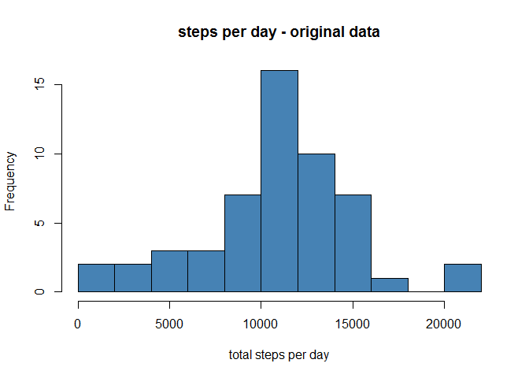
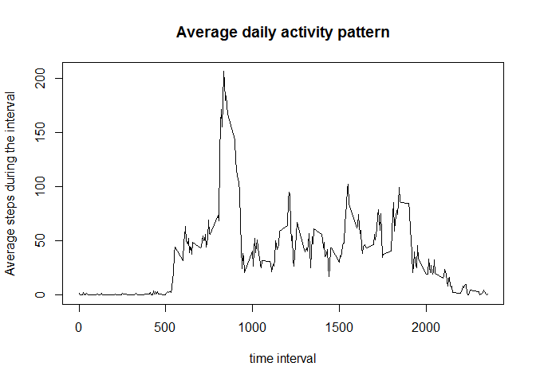
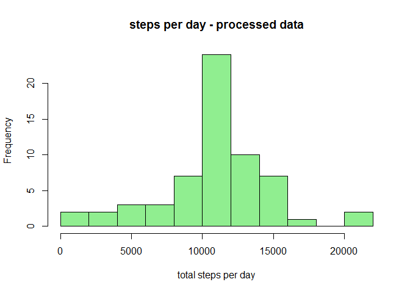
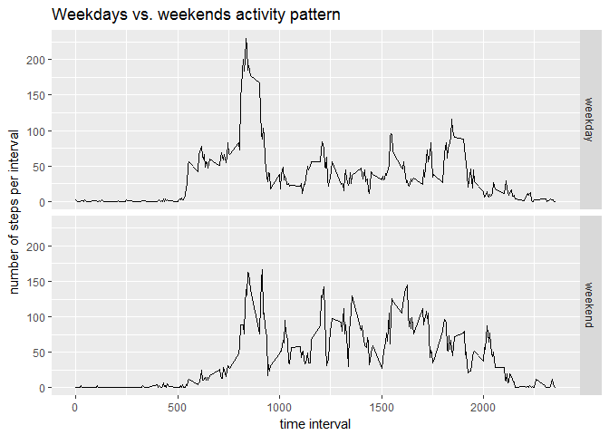

# My_RR_assignment1


This document represents Reproducible Research course assignment 1.

The code below reads and processes the data from the source file "activity.csv"

which should be downloaded from the course page and put into the working 

directory.


## Load the data and setup packages


```r
library(stats)
library(ggplot2)
activity_data <- read.csv("activity.csv")
activity_data$date <- as.character(activity_data$date)
activity_data$date <- as.Date(activity_data$date, "%Y-%m-%d")
```


## Question 1. What is mean total number of steps taken per day?

We calculate the mean number of steps per day using the "aggregate" function.


```r
tot_steps <- aggregate(. ~ date, data = activity_data, FUN = sum)
```

We then plot the histogram of steps per day using the base plotting system.


```r
hist(tot_steps$steps, main = "steps per day - original data",
     xlab = "total steps per day", col = "steelblue", breaks = 10)
```

<!-- -->

The mean and median of the total number of steps taken per day are returned

below:

### Mean


```r
mean(tot_steps$steps)
```

```
## [1] 10766.19
```

### Median


```r
median(tot_steps$steps)
```

```
## [1] 10765
```


## Question 2. What is the average daily activity pattern?

We aggregate the number of steps by time intervals as follows:


```r
avg_int <- aggregate(. ~ interval, data = activity_data[, c(1,3)],
        FUN = mean)
```

Then make a plot of average activity during time intervals


```r
plot(avg_int$interval, avg_int$steps, type = "l",
     main = "Average daily activity pattern",
     xlab = "time interval", ylab = "Average steps during the interval")
```

<!-- -->


### Interval containing maximum number of steps


```r
avg_int[which.max(avg_int$steps), ]
```

```
##     interval    steps
## 104      835 206.1698
```


It appears that the time interval, which contains the maximum average number of steps during the day, starts at 8.35 AM. The average number of steps during this 5-minute interval is 206.17


## Question 3. Imputing missing values and recalculating steps per day.

In questions 1 and 2 the missing data for number of steps in some intervals was ignored. This time we replace the missing values by the average values calculated for the corresponding time intervals.

First, we calculate the number of missing values ("NA" values). It appears that there are 2304 instances of missing observations in "steps" variable. There are no missing values in dates or intervals.

### Number of rows with missing values for "steps"


```r
sum(is.na(activity_data$steps))
```

```
## [1] 2304
```

### Number of rows with missing values for other variables


```r
sum(is.na(activity_data$date))
```

```
## [1] 0
```

```r
sum(is.na(activity_data$interval))
```

```
## [1] 0
```

### Create a copy of original data set but with imputed values instead of NAs

We take the average values calculated earlier for each time interval, and from that we make a new column "mean_steps" which is the same length as the main data set ("activity_data"). We then create a copy of the main data set and add the new column with the mean step values to it.


```r
intervals <- avg_int[, 2]
mean_steps <- rep(intervals, 61)
corr_data <- cbind(activity_data, mean_steps)
```

For those rows that contain missing values in the "steps" column we replace them with values from the "mean_steps" column. Then we remove the "mean_steps" column which we don't need any more, and create a corrected copy of the original data set.


```r
corr_data$steps <- ifelse(is.na(corr_data$steps), corr_data$mean_steps,
        corr_data$steps)
activity_data_corrected <- corr_data[, 1:3]
```

### Calculate the new number of steps per day and plot the new histogram

As before, we aggregate the data


```r
tot_steps2 <- aggregate(. ~ date, data = activity_data_corrected, FUN = sum)
```

and make a new plot


```r
hist(tot_steps2$steps, main = "steps per day - processed data",
     xlab = "total steps per day", col = "lightgreen", breaks = 10)
```

<!-- -->

### New mean and median number of steps per day

Effectively, when we replaced the missing values with calculated mean values we added more observations that equal our mean value. That reduced the variance within the data, and the median of the new data set is now equal to it's mean. Not surprisingly, the mean of the new data set is equal to the mean of the original data set.

The mean is now

```r
mean(tot_steps2$steps)
```

```
## [1] 10766.19
```

The new median is

```r
median(tot_steps2$steps)
```

```
## [1] 10766.19
```
which is equal to the mean.

Although we increased the total number of steps recorded in the data set by adding some data instead of missing observations, our mean and median values were not significantly affected.

The total number of steps for all observations increased by 15.1%

```r
(sum(tot_steps2$steps) - sum(tot_steps$steps)) / sum(tot_steps$steps) * 100
```

```
## [1] 15.09434
```

The mean number of steps per day did not change

```r
(mean(tot_steps2$steps) - mean(tot_steps$steps)) / mean(tot_steps$steps) * 100
```

```
## [1] 0
```

The median number of steps per day increased by 0.01%

```r
(median(tot_steps2$steps) - median(tot_steps$steps)) / median(tot_steps$steps) * 100
```

```
## [1] 0.01104207
```


## Question 4. Are there differences in activity patterns between weekdays and weekends?

We created a new factor variable to represent weekdays and weekends, and added that variable to the data set.

The data set used is the one with missing values replaced by imputed values. 


```r
weekday <- weekdays(activity_data_corrected$date, abbreviate = TRUE)
weekends <- as.factor(ifelse(weekday == "Sat" | weekday == "Sun", "weekend",
        "weekday"))
activity_data_corrected_weekdays <- cbind(activity_data_corrected, weekends)
```

We aggregate the data by time interval and weekday


```r
avg_int_weekd <- aggregate(. ~ interval + weekends, 
        data = activity_data_corrected_weekdays, FUN = mean)
```

and compare the patterns of activity with a panel plot.


```r
p <- qplot(interval, steps, data = avg_int_weekd, geom = "line", 
    xlab = "time interval", ylab = "number of steps per interval", 
    main = "Weekdays vs. weekends activity pattern", facets = weekends ~.)
p
```

<!-- -->

